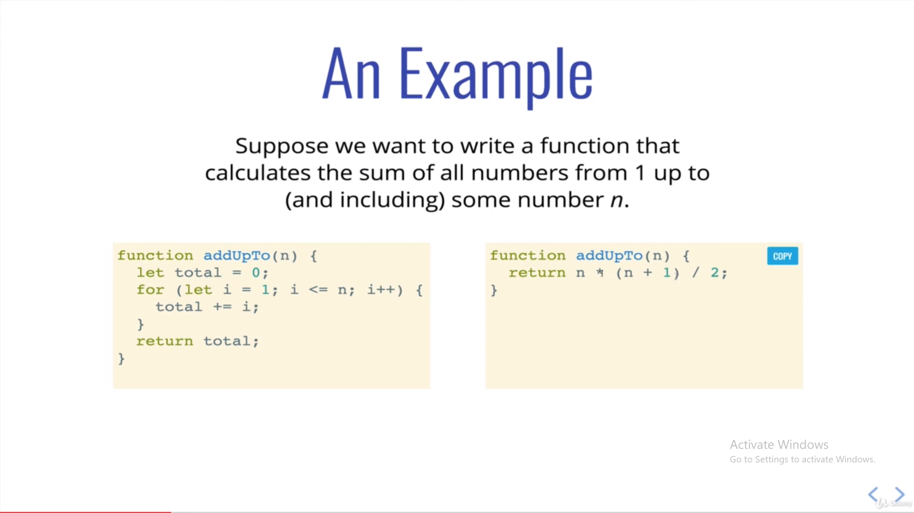
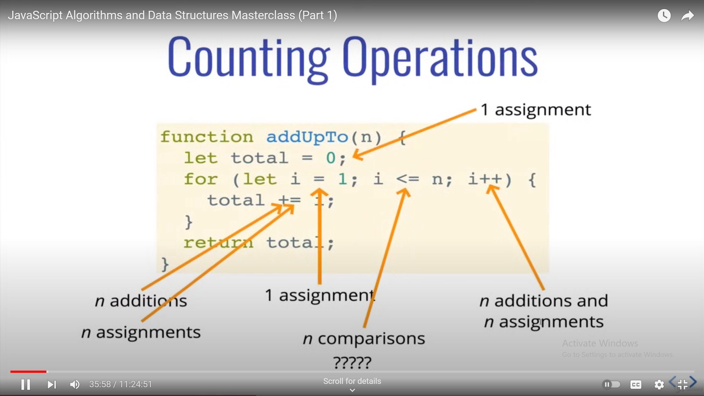
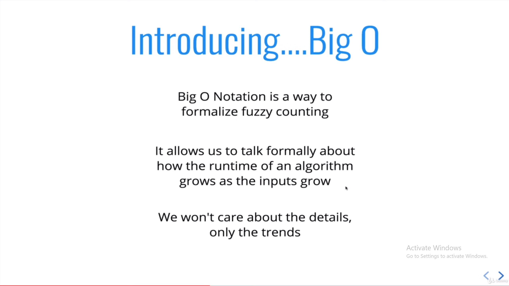

<!---------------- DSA ----------------------->

<!---------------- BIG O NOTATION ---------------->

<h1> Big O Notation </h1>

* Aik kaam krny k multiple tareeqe hote hai, to usmy s best possible code and performance ko nikaalny k liye BigO Notation use krty hai hum

* Big Notation k liye hum number of operations ko count krty hai, like kitni mulitiply, divide subtract add etc operations. Is s pta chalta hai k code kitna fast or efficient hoga

* Jb Hum Big O ki bt krty hai to hum worst case scenario ki bt krty hai

