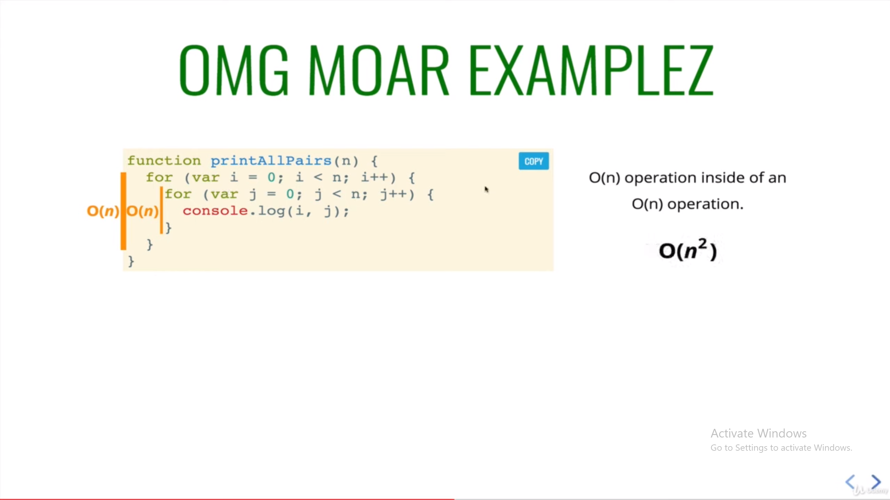
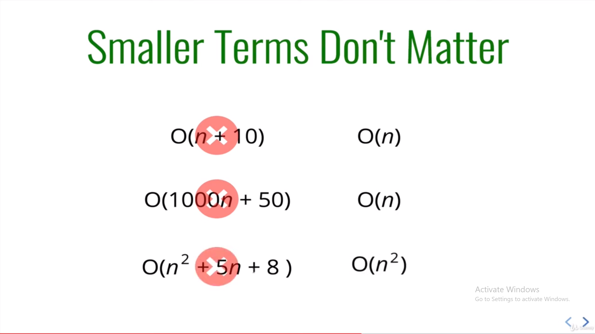
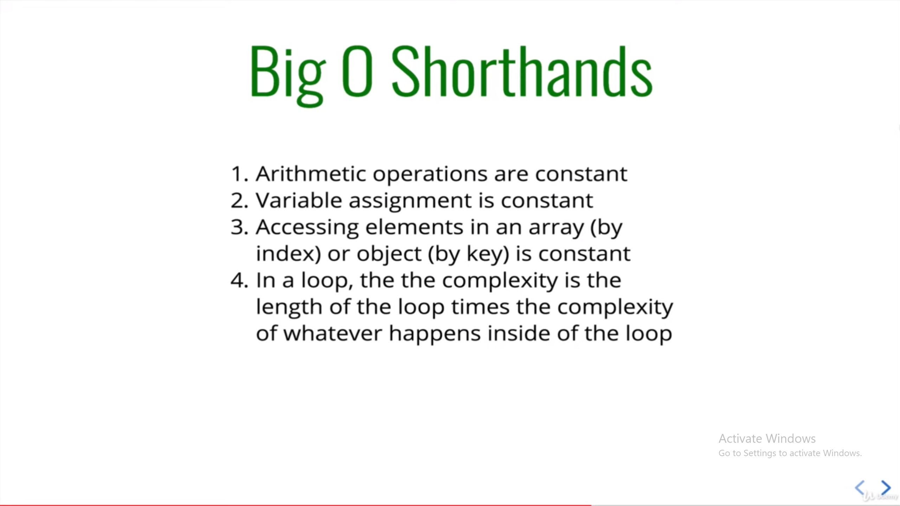

<!---------------- DSA ----------------------->

<!---------------- BIG O NOTATION ---------------->

<h1> Big O Notation </h1>

* Aik kaam krny k multiple tareeqe hote hai, to usmy s best possible code and performance ko nikaalny k liye BigO Notation use krty hai hum

* Big Notation k liye hum number of operations ko count krty hai, like kitni mulitiply, divide subtract add etc operations. Is s pta chalta hai k code kitna fast or efficient hoga

* Jb Hum Big O ki bt krty hai to hum worst case scenario ki bt krty hai

* Constants matter nh krty, like 2n k case m 'n' hi chalega, 15n square k case m 'n square' hi chalega etc

<h1> Algorithms </h1>

* Algorithm is a set of well defined instructions to solve a problem
* well defined inputs and outputs
* language independent

<h2> Algorithm Analysis </h2>

* Time complexity ------> Time taken by an Algo to run, as a function of input size 
* Space complexity -----> Memory taken by an Algo to run, as a function of input size

* Primarly hum algo k worst case scenario ko dekhty hai. ( Best or Average case scenarios ko nh )

console.log("Hello from DSA")

// Fibonacci Sequence for n number of elements [0,1,1] [0,1,1,2,3,5]

// aik number lena hai function mai
// us number ko previous m add krwayengy ( initial 0 )
// jo previous 2 ka sum hai usey 3rd place pr rakhengy, loop chalega till that number 
// Steps to follow:
// 1. Initialize an array to store the Fibonacci sequence.
// 2. Start a loop from 0 to the given number.
// 3. In each iteration, calculate the next Fibonacci number as the sum of the last two numbers.
// 4. Add the calculated number to the array.
// 5. Return the array at the end of the function.

const fibonacciFunc = (number) => {
    let array = [0, 1]; // Initialize the array with the first two Fibonacci numbers
    for (let i = 2; i < number; i++) {
        array.push(array[i - 1] + array[i - 2]); // Calculate the next Fibonacci number and add it to the array
    }
    return array; // Return the array at the end of the function
}

// BigO is = O(n)

console.log(fibonacciFunc(2))
console.log(fibonacciFunc(7))

// Factorial nikaalna hai 

// Steps to follow 

// 1. Function bnega jo number lega as parameter
// 2. Intial value 1 rakhengy, jo k new value ko store krlega
// 3. phir isey new value k sath multuple krwaaty jayengy

const factorialNumber = (number) => {
    let initNumber = 1
    for (let i = 2; i <=number ; i++){
        initNumber = initNumber * i

    }
    return initNumber
}

// Separate logic for factorialNumber2
const factorialNumber2 = (number) => {
    if (number === 0) return 1;
    return number * factorialNumber2(number - 1);
}

console.log("factorialNumber", factorialNumber(5))
console.log("factorialNumber2", factorialNumber2(5))